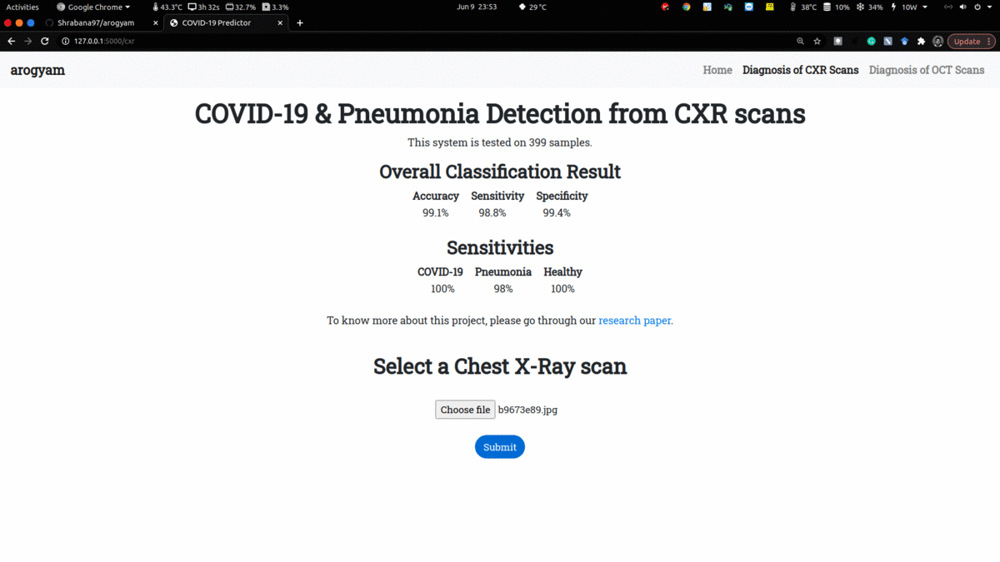
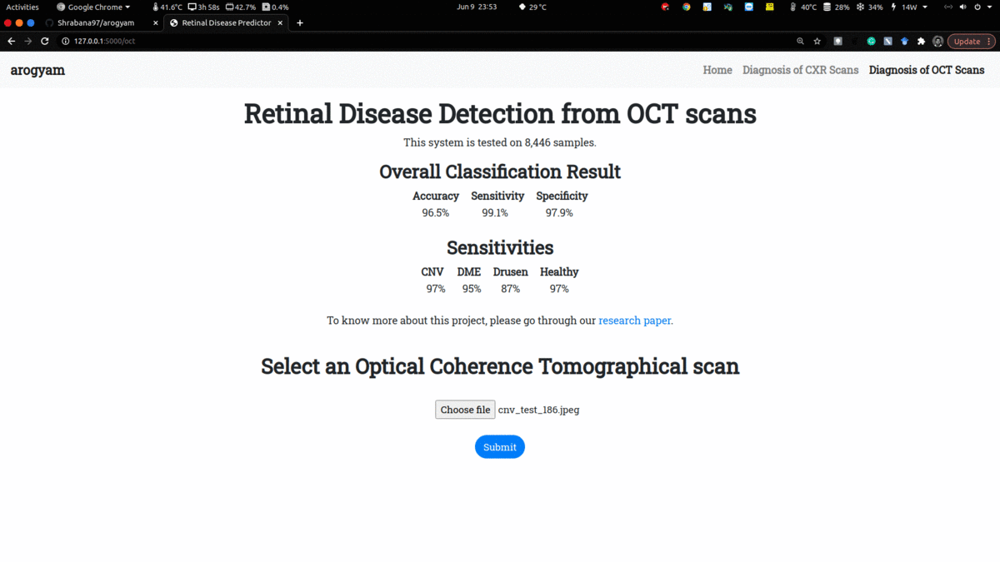

# arogyam 

## About

**arogyam** is an AI assisted platform which promises accurate diagnosis of different diseases. The AI engine of this system is built using **deep multi-layered convolution neural network (CNN)** for image-based diagnosis. This platform mainly focuses on diagnosis of chest x-ray (CXR) scans for **COVID-19 & Pneumonia detection**. To verify the robustness of the AI engine the system is also evaluated on classification of optical coherence tomographical (OCT) scans for **retinal disease detection**.

Coronavirus disease or COVID-19 carried out by Severe Acute Respiratory Syndrome Corona Virus 2 (SARS-CoV-2) made an appearance as a pandemic across the globe by early 2020. From April 2021, India is experiencing the 2nd wave of COVID-19 where the virus has gone through several mutations. Thus, traditional diagnostic tools are having a hard time detecting the virus at an early stage. CXR scans are have major contributions in diagnosis COVID-19. In this context, an intelligent method for diagnosis of pneumonia & COVID-19 disease from CXR scans using a deep multi-layered CNN has been put forward. Using this approach, the experiment has been done on multiple publicly available datasets. Classification of retinal diseases using OCT scans have also been done to substantiate the robustness of the proposed AI engine for which a separate deep multi-layered CNN has been proposed which detects Choroidal NeoVascularization (CNV), Diabetic Macular Edema (DME) & DRUSEN from retinal OCT scans.

**The first deep CNN model classifies between COVID-19, Pneumonia & Healthy CXR scans with a blind test accuracy of 99.1% (tested on 399 samples). The second deep CNN model classifies between OCT scans of CNV, DME, DRUSEN & Healthy people with a blind test accuracy of 96.5% (tested on 8,446 images)**.

Exploratory results exemplify the efficacy of the proposed system in diagnosis of CXR scans and OCT scans. In near future, the proposed AI-aided platform is going to consist with more disease diagnostic systems.

## Run at your own machine:
### Linux:
* `git clone https://github.com/Shrabana97/arogyam.git`
* `cd arogyam`
* `pip3 install -r requirements.txt`
* `python3 app.py`
